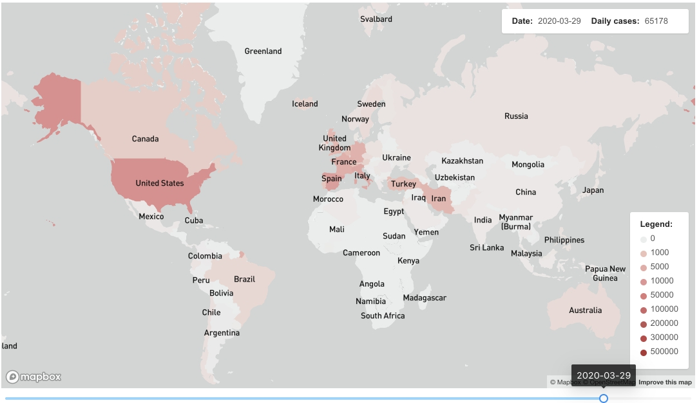
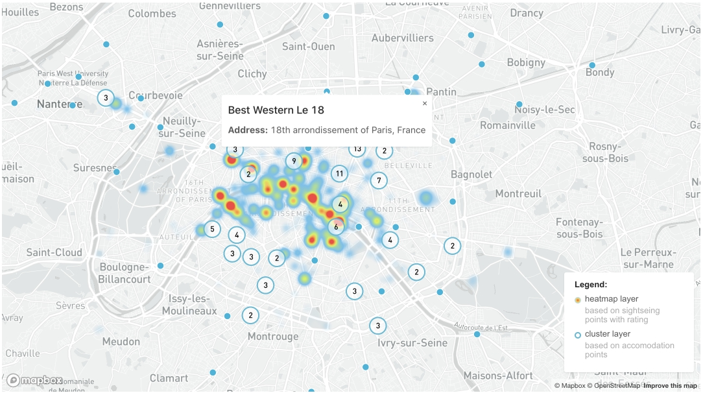

This example is about data visualization on maps. I used Mapbox API as a map tool, Cube.JS to retrieve data and PostgreSQL as a database. If you’re not familiar with Cube.JS yet, please visit [Cube JS Sample React app tutorial](https://cube.dev/blog/cubejs-open-source-dashboard-framework-ultimate-guide/) before continuing this tutorial.

As the start point I used a sample Cube.JS React app.

## What is this example about?

In this example there are two independent parts:

- How to render a choropleth layer based on pandemic outbreak data.
- How to render heatmap and cluster layers based on points of interest and accommodation sites in Paris.

## Setting up a Backend

To create the `mapbox__example` database, please, use the following commands.

```javascript
$ createdb mapbox__example
$ psql --dbname mapbox__example -f mapbox-dump.sql
```

Next, install Cube.js CLI if you don’t have it already and generate a new application.

```javascript
$ npm install -g cubejs-cli
$ cubejs create mapbox-data -d postgres
```

Cube.js uses environment variables for configuration. To configure the connection to our database, we need to specify the DB type and name. In the Cube.js project folder, replace the contents of the .env file with the following:

```javascript
CUBEJS_API_SECRET = SECRET;
CUBEJS_DB_TYPE = postgres;
CUBEJS_DB_NAME = mapbox__example;
CUBEJS_DB_USER = postgres;
CUBEJS_DB_PASS = postgres;
```

Now, start the development server and open the [localhost:4000](https://localhost:4000/) in your browser.

```javascript
$ npm run dev
```

## Adding Mapbox to the project

I used this [React Mapbox wrapper](http://visgl.github.io/react-map-gl/). You can find some other Mapbox plugins for React, Angular and other frameworks at [Mapbox Documentation](https://docs.mapbox.com/mapbox-gl-js/plugins/).

# Choropleth layer



## Data structure

To visualize those data I used three tables:

- `stats` – table with outbreak statistics: daily cases by country
- `mapbox` – service table, that contains country names, shortened names, iso codes etc. To join it with `stats`, we used `stats.countryandterritorycode` and `mapbox.iso_a3`
- `mapbox__coords` – service table that contains polygon coordinates. Some countries have continues borders, others like USA with the region of Alaska and Hawaii or the islands of Japan have two or many separate polygons. To join `mapbox` with `mapbox__coordinates` we used column `iso_a3`.

## Component description

I implemented dynamic data visualization: data rendering on the map depends on the date that can be changed using the slider under the map.

For performance reasons and to render the map faster I used only three database requests on page loading:

1. one to define the start and the end date from our dataset.
2. one to load data and to create an object with geoJSONs by date at component state
3. one to load total cases data by date

Here is the query for the second request:

```javascript
measures: ['stats.total'],
dimensions: [
    'stats.countryterritorycode',
    'mapbox.name',
    'mapbox__coords.coordinates'
    ],
timeDimensions: [
    {
        dimension: 'stats.date',
        granularity: 'day'
    }
    ],
limit: 20000,
```

In this query we used [Transitive Joins](https://cube.dev/docs/joins#transitive-joins): so we didn’t need to join `stats` table with `mapbox__coords` table directly.

We joined `stats` table with `mapbox` table and then`mapbox` table with `mapbox__coords` table.

To get data for every day between the start and the end date we set [granularity](https://cube.dev/docs/query-format#time-dimensions-format) as ‘day’.

Due to large amount of data rows: amount of days, countries and polygons we needed to set up the [limit](https://cube.dev/docs/query-format#query-properties) field, because I expected more rows that are provided by default.

After we got results we created an object with a date as a key and a geojson as a value.

Depending on the chosen date we used a geoJSON as a Source for Fill Layer at the map.

We used the same process to display a total cases amount at the top right corner of the map.

Here is the query to get total cases by day:

```javascript
    measures: ['stats.total'],
    timeDimensions: [
        {
            dimension: 'stats.date',
            granularity: 'day'
        }
    ]
```

## Useful links:

- [Documentation for fill layer, its parameters and settings ](https://docs.mapbox.com/mapbox-gl-js/style-spec/layers/#fill)
- [Choropleth layer example at Mapbox.Documentation](https://docs.mapbox.com/mapbox-gl-js/example/updating-choropleth/)

# Heatmap and cluster layers



## Data structure

We needed two tables to implement this example:

- `paris__poi` – table that containts data about Paris sightseeing points with rating. Heatmap layer in this example based on rating data.
- `paris__accomodation` – table that contains data about Paris hotels etc.

## Heatmap layer

Here is the query to get data for the heatmap layer:

```javascript
{
    dimensions: [
        'paris__poi.name',
        'paris__poi.rating',
        'paris__poi.lat',
        'paris__poi.lng'
    ],
}
```

We needed to set up the heatmap layer:

- at `heatmap-weight` we defined the field `property.rating` as a base for the heatmap layer
- at `heatmap-color` we created a palette for our heatmap

Here you can find more information about heatmap layers:

- [What does mean expressions [‘interpolate’,[‘linear’] …]](https://docs.mapbox.com/mapbox-gl-js/style-spec/expressions/)
- [Heatmap layer example at Mapbox.Documentatio](https://docs.mapbox.com/help/tutorials/make-a-heatmap-with-mapbox-gl-js/)
- [Heatmap layers params descriptions](https://docs.mapbox.com/mapbox-gl-js/style-spec/layers/#heatmap)
- [Some theory about heatmap layers settings, palettes](https://blog.mapbox.com/introducing-heatmaps-in-mapbox-gl-js-71355ada9e6c)

## Cluster layer

We needed to create three layers to implement clusters:

- one for circle rendering
- one for digits rendering
- one for unclustered points

Similar to previous examples we created a geoJSON with points and set it as a source data for these layers.

Here you can find more information about cluster layers:

- [Mapbox Clustering example](https://docs.mapbox.com/mapbox-gl-js/example/cluster/)
- [Mapbox Documentation about symbol layers params, settings](https://docs.mapbox.com/mapbox-gl-js/style-spec/layers/#symbol/)

If you have any feedback or questions about this tutorial or about Cube.js in general — feel free to use our [Slack Cube.js community](http://slack.cube.dev/) or drop an email to [yulia@kotova.ru](mailto:yulia@kotova.ru)
